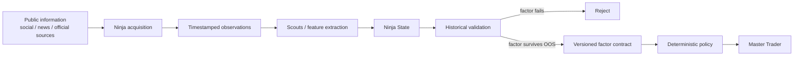

# Ninja

**Ninja is an alternative-information research engine for Master Trader.**

Markets do not react only to price, volume, funding or open interest. They also react to information: a new event appears, people notice it, communities transmit it, narratives converge or disagree, and that information interacts with the current fragility of the market.

Ninja exists to measure that process.

It is **not** an AI trader. It does not ask a language model whether BTC should be bought or sold. Its job is to turn noisy, unstructured public information into timestamped, testable quantitative factors. Only factors that survive historical and out-of-sample validation may cross the deterministic boundary into Master Trader.

> **Status:** research foundation. The scientific ideas documented here have literature support, but Ninja has **not yet independently validated them on its own historical cross-platform dataset**. Reproducing or falsifying them is Phase 1.

## In plain language

Imagine two identical-looking price drops.

In the first, price is temporarily stretched and social activity is normal.

In the second, discussion of a possible exchange failure has suddenly exploded across several communities, independent authors are repeating the same new claim, the narrative is propagating rapidly, and the market is already highly leveraged.

A price chart may initially make both situations look similar. Ninja asks whether the **information state around the market** can distinguish them.

The project starts from three concepts:

1. **Shock** — did genuinely new information appear?
2. **Transmission** — how is attention spreading through communities and platforms?
3. **Susceptibility** — is the market currently in a state where that information can be amplified?

Ninja attempts to estimate these states without giving an LLM authority over trading decisions.

## The six scouts

Ninja is organized as six research/feature scouts. They are not trading agents.

| Scout | Question | Example outputs |
|---|---|---|
| **Attention** | Is collective attention abnormal? | attention surprise, acceleration, breadth |
| **Divergence** | Do participants/platforms agree? | polarization, disagreement, homogeneity |
| **Narrative** | What is the information structure? | novelty, entropy, concentration, emergence |
| **Propagation** | How is information spreading? | activation order, latency, Hawkes excitation, information flow |
| **Event Morphology** | What kind of event is this, structurally? | actor/action/target/family/credibility/confirmation |
| **Susceptibility** | Is the financial system vulnerable to amplification? | volatility, liquidity, funding, OI, leverage/regime context |

The combined output is a **Ninja State**, not a single "Ninja score".

```text
NinjaState(asset, time) =
    Attention
  + Divergence
  + Narrative
  + Propagation
  + Event Morphology
  + Market Susceptibility
```

## From internet noise to deterministic action



A language model may be used **before** the deterministic boundary to convert unstructured text into a typed observation. Example:

```text
"Withdrawals are temporarily paused..."
        ↓
event_family = operational_disruption
actor_type   = exchange
action       = withdrawal_pause
first_party  = true
```

But the model does **not** decide financial severity, position size, BUY/SELL or execution. Financial weights must be learned and validated from data.

## How action is allowed to happen

Ninja factors cannot directly trade.

A factor becomes actionable only through a versioned **Policy** whose behavior is deterministic and whose supporting experiment is recorded.

Permitted action classes are initially:

- **observe** — shadow logging only;
- **gate** — allow/block a new entry;
- **size** — deterministic position-size multiplier;
- **risk mode** — reduce/increase predefined risk constraints;
- **strategy input** — expose a validated numeric feature to a strategy.

Example, shown only as a contract shape:

```text
policy_id: keltner-event-risk-v1
experiment_id: N8-keltner-003
input: event_risk_v2
action: block_new_entry
threshold: <value established by frozen validation>
valid_for: SOL/USDT
```

No threshold is accepted because it "looks reasonable".

## Research before production

Ninja has two major phases.

### Phase 1 — historical science

Reconstruct historical information states and test them against market outcomes.

Core question:

> Does adding Ninja information improve an out-of-sample market-only baseline?

The first targets are deliberately **not** BUY/SELL:

- future realized volatility;
- jump probability;
- volume surprise;
- liquidity deterioration;
- maximum adverse excursion;
- tail-loss / stop-hit probability;
- regime transition.

Directional return is a later target.

### Phase 2 — prospective/live information

After useful factors are identified, live collectors such as Last30Days, dedicated crawlers and public-source monitors can produce point-in-time observations. The same frozen feature definitions used in research must be used in live serving.

## Master Trader relationship

Ninja is a separate repository because crawling, NLP, embeddings, network models and research data should not live inside the trading runtime.

Master Trader should see only a small, deterministic interface:

```text
NINJA OFF
Master Trader → existing behavior

NINJA ON (shadow)
Master Trader → existing behavior + Ninja logging

NINJA ON (validated policy)
Master Trader → existing strategy + explicitly approved deterministic Ninja policy
```

Existing Master Trader strategies must never require Ninja unless that dependency is deliberately introduced and validated.

## Scientific discipline

Ninja assumes most candidate factors will fail.

Every promoted factor must beat a market-only baseline on untouched chronological data and survive robustness checks. A beautiful equation with no incremental out-of-sample information is removed.

The project therefore distinguishes:

- **literature-backed** — published evidence exists;
- **replication target** — Ninja has not reproduced it yet;
- **Ninja hypothesis** — our proposed extension;
- **validated** — reproduced by Ninja and survived the registered test;
- **production candidate** — validated and technically suitable for live shadow;
- **production** — explicitly approved in Master Trader.

See:

- [Scientific foundation](docs/SCIENTIFIC_FOUNDATION.md)
- [Architecture](docs/ARCHITECTURE.md)
- [Hypothesis registry](docs/HYPOTHESES.md)
- [Research program](docs/RESEARCH_PROGRAM.md)
- [Master Trader integration](docs/MASTER_TRADER_INTEGRATION.md)
- [Validation status](docs/VALIDATION_STATUS.md)
- [Contributing](CONTRIBUTING.md)

## Current thesis

The strongest current working hypothesis is:

[
	ext{Market response}
=
f(
	ext{information shock},
	ext{propagation},
	ext{market susceptibility},
	ext{market state}
)
]

The goal of Ninja is not to prove this idea.

The goal is to make it precise enough to **disprove it**.
