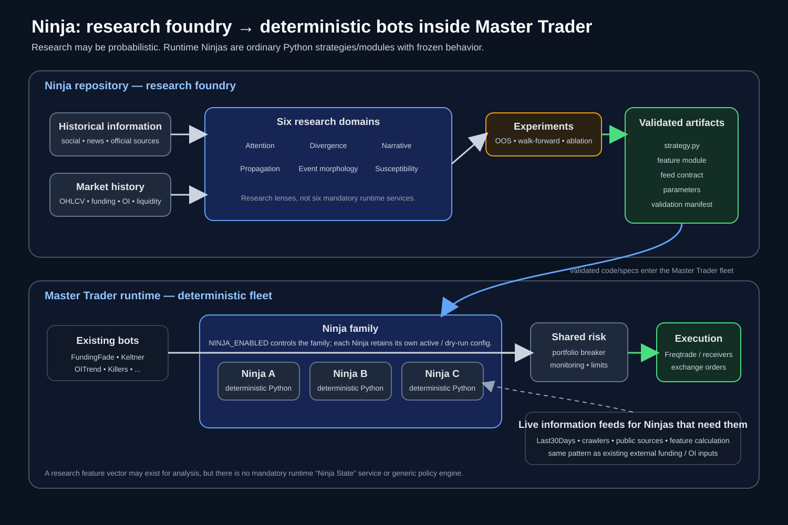

# Ninja

**Ninja researches alternative-information signals for deterministic strategies in Master Trader.**

The project has three jobs:

1. collect or reconstruct timestamped public information;
2. measure whether that information adds out-of-sample value beyond market data and existing strategy baselines;
3. turn validated results into versioned Python strategies or modules for the Master Trader fleet.

LLMs and embeddings may be used to structure unstructured data. They do not receive order authority.

> **Status:** the repository currently contains the research framework, hypotheses and experiment designs. Ninja has not yet completed an independent historical cross-platform validation, and no Ninja implementation is approved for live trading.

---

## Contents

1. [Problem definition](#problem-definition)
2. [Working systems hypothesis](#working-systems-hypothesis)
3. [Research variables](#research-variables)
4. [Research domains and Ninja implementations](#research-domains-and-ninja-implementations)
5. [Runtime model](#runtime-model)
6. [Scientific model](#scientific-model)
7. [Mathematical core](#mathematical-core)
   - [Attention](#1-attention)
   - [Cross-platform attention](#2-cross-platform-attention)
   - [Divergence and polarization](#3-divergence-and-polarization)
   - [Narrative entropy and novelty](#4-narrative-entropy-and-novelty)
   - [Propagation and Hawkes processes](#5-propagation-and-hawkes-processes)
   - [Transfer Entropy](#6-transfer-entropy)
   - [Event Morphology](#7-event-morphology)
   - [Susceptibility](#8-susceptibility)
8. [Complexity science: what transfers and what does not](#complexity-science-what-transfers-and-what-does-not)
9. [Research program](#research-program)
10. [Initial experiments](#initial-experiments)
11. [Historical data strategy](#historical-data-strategy)
12. [Promotion and deployment criteria](#promotion-and-deployment-criteria)
13. [Master Trader integration](#master-trader-integration)
14. [Ninja OFF / ON and per-bot dry-run](#ninja-off--on-and-per-bot-dry-run)
15. [Repository boundary: separate project or part of Master Trader?](#repository-boundary-separate-project-or-part-of-master-trader)
16. [Semantic processing](#semantic-processing)
17. [Validation rules](#validation-rules)
18. [Current evidence status](#current-evidence-status)
19. [Roadmap](#roadmap)
20. [Repository map](#repository-map)

---

# Problem definition

Master Trader already combines deterministic market strategies with externally supplied signals. Ninja tests a narrower question: whether public-information data can be converted into quantitative variables that improve those systems.

The initial targets are realized volatility, jump probability, maximum adverse excursion, stop-hit probability, liquidity deterioration and regime transitions. Directional return is secondary.

The unit of analysis is not a generic sentiment score. It is the measurable state of attention, disagreement, narrative structure, propagation, event type and market context at a specific time.

---

# Working systems hypothesis

The research model separates three mechanisms.

## 1. Information shock

New information entering the observed system, including:

- exploit or outage;
- listing or delisting;
- regulation or enforcement;
- legal action;
- geopolitical escalation;
- first-party announcement;
- sudden emergence of a new market narrative.

## 2. Transmission

The path and rate at which information spreads, measured with variables such as:

- number of independent sources;
- cross-platform activation order;
- propagation latency;
- cascade depth;
- self- and cross-excitation;
- community breadth.

## 3. Market susceptibility

The financial state in which the information arrives, including:

- realized volatility;
- liquidity;
- open interest;
- funding;
- liquidation pressure;
- leverage proxies;
- broad market regime.

A compact working model is:

```math
Y_{t+h}
=
f(
M_t,
Q_t,
T_t,
S_t
)
+
\epsilon_{t+h}
```

where $M_t$ is conventional market state, $Q_t$ information shock, $T_t$ transmission and $S_t$ susceptibility.

This decomposition defines the research variables. It does not require a particular functional form or require every term to appear in a production strategy.

---

# Research variables

For research, candidate information features are grouped as:

```math
N_{a,t}
=
[
ATT,
DIV,
NAR,
TRN,
EVT,
CTX
]_{a,t}
```

where:

- **ATT** — attention;
- **DIV** — disagreement / divergence;
- **NAR** — narrative structure;
- **TRN** — transmission / propagation;
- **EVT** — event morphology;
- **CTX** — market susceptibility / context.

This vector is only a notation for organizing experiments. It is not a required runtime object and there is intentionally no global `NinjaScore`.

A production Ninja should consume only the variables required by its validated implementation.

---

# Research domains and Ninja implementations

The six domains organize the research space. They do not map one-to-one to services or trading bots.

| Research domain | Main question | Candidate measurements |
|---|---|---|
| **Attention** | Is collective attention abnormal? | surprise, acceleration, breadth, concentration |
| **Divergence** | Do participants or platforms disagree? | stance variance, polarization, homogeneity, cross-platform divergence |
| **Narrative** | Is the information structure changing? | novelty, entropy, concentration, emergence, change points |
| **Propagation** | How is information spreading? | activation order, latency, Hawkes excitation, directed information flow |
| **Event Morphology** | What kind of event is this structurally? | actor/action/target/family/authority/confirmation/scope |
| **Susceptibility** | Is the current market vulnerable to amplification? | volatility, liquidity, funding, OI, liquidations, regime |

A promoted Ninja is a deterministic implementation in the Master Trader fleet. A validated result may become:

1. a standalone Freqtrade strategy;
2. a deterministic filter/overlay used by an existing strategy;
3. a deterministic risk or regime module.

One implementation may combine several research domains.

Example only:

```text
Ninja X
  inputs:
    attention surprise
    propagation latency
    funding
    open interest

  behavior:
    deterministic Python entry/exit/risk logic
```

Runtime names are assigned after the behavior and inputs are defined by a validated experiment.

---

# Runtime model

Ninja contains research, validation and candidate implementations. Promoted code runs in Master Trader.

<p align="center">
  
</p>

Promotion path:

```text
historical data + market history
        ↓
research domains
        ↓
registered experiments
        ↓
validated implementation
        ↓
Python strategy / overlay / risk module
        ↓
Master Trader fleet
```

Research may use probabilistic models. Runtime decisions are deterministic Python. No `NinjaState` service or generic policy engine is required.

---

# Scientific model

Let the conventional market state be

```math
M_{a,t}
=
[
r,
RV,
V,
L,
OI,
F,
Q,
B,
\ldots
]_{a,t}
```

where the vector may include:

- lagged returns;
- realized volatility;
- volume;
- liquidity / spread / depth;
- open interest;
- funding;
- liquidations / order flow;
- broad-market or BTC regime.

For research, it is useful to denote the candidate Ninja feature space as:

```math
N_{a,t}
=
[
ATT,
DIV,
NAR,
TRN,
EVT,
CTX
]_{a,t}.
```

This is **mathematical notation for a feature space**, not a required runtime object or service.

A validated runtime Ninja $k$ consumes only the subset of features it actually needs:

```math
F_{k,t}
\subseteq
N_{a,t}
```

and executes a frozen Python decision rule:

```math
a_{k,t}
=
\pi_k(
M_t,
F_{k,t};
\theta_k
)
```

where $\pi_k$ is the implementation and $\theta_k$ its frozen parameter set. The same inputs, code version and parameters must produce the same action.

For target $Y_{a,t+h}$, the primary test is incremental out-of-sample performance:

```math
\Delta_h
=
\mathcal L(
Y_{t+h},
\hat f(M_t)
)
-
\mathcal L(
Y_{t+h},
\hat g(M_t,N_t)
).
```

A candidate is rejected when the added information does not improve the relevant out-of-sample loss by a practically meaningful amount.

---

# Mathematical core

The following section summarizes the main mathematical families directly in the README. Full derivations, assumptions and failure modes are preserved in [docs/MATHEMATICAL_FRAMEWORK.md](docs/MATHEMATICAL_FRAMEWORK.md).

---

## 1. Attention

### Raw counting process

For asset $a$, platform $p$, interval $(t-\Delta,t]$:

```math
N_{a,p,t}^{(\Delta)}
=
\sum_i
\mathbf 1[
a\in entity(o_i),
p_i=p,
t-\Delta<t_i\le t
].
```

Raw counts are not enough because activity is highly seasonal and overdispersed.

### Robust attention surprise

Candidate robust estimator:

```math
AZ_{a,p,t}
=
\frac{
N_{a,p,t}
-
\mathrm{median}(\mathcal W_{a,p,t})
}{
1.4826
\mathrm{MAD}(\mathcal W_{a,p,t})
+\epsilon
}.
```

This measures how abnormal the current attention level is relative to a trailing historical baseline.

### Negative-Binomial attention surprise

Social counts often have variance much larger than their mean.

Assume:

```math
N_t\sim NB(\mu_t,\phi)
```

with:

```math
Var(N_t)
=
\mu_t+\frac{\mu_t^2}{\phi}.
```

Then:

```math
AS_t
=
\frac{N_t-\mu_t}
{\sqrt{\mu_t+\mu_t^2/\phi}}.
```

A baseline intensity may include:

```math
\log\mu_t
=
\beta_0
+
f_{hour}(t)
+
f_{dow}(t)
+
f_{trend}(t)
+
\gamma_a
+
\gamma_p.
```

The model adjusts raw counts for expected activity and overdispersion.

### Attention acceleration

For normalized attention $A_t$:

```math
\Delta A_t=A_t-A_{t-1}
```

and

```math
\Delta^2A_t
=
(A_t-A_{t-1})
-
(A_{t-1}-A_{t-2}).
```

The second difference is a candidate measure of attention acceleration.

### Author concentration

If author $u$ produces share $s_u$ of messages:

```math
HHI
=
\sum_u s_u^2.
```

A high HHI means attention is concentrated among few authors.

### Author entropy

```math
H_A
=
-
\frac{
\sum_u s_u\log s_u
}{
\log U
}.
```

High entropy means attention is distributed across many authors.

### Effective attention

Raw message count overstates independent activity when many posts are duplicated or concentrated among a small set of accounts.

Given redundancy weights $w_i$:

```math
N_{\text{eff}}
=
\frac{
(\sum_i w_i)^2
}{
\sum_i w_i^2
}.
```

A candidate echo statistic is:

```math
EchoRatio
=
1-\frac{N_{\text{eff}}}{N}.
```

This is a Ninja hypothesis that must be validated.

---

## 2. Cross-platform attention

For $P$ sources:

```math
\mathbf A_{a,t}
=
[
A_{a,1,t},
A_{a,2,t},
\ldots,
A_{a,P,t}
]^\top.
```

Platform series are estimated separately before any common factor is fitted.

A simple common-attention factor can be estimated using PCA:

```math
F_t
=
w_1^\top\mathbf A_t.
```

Platform-specific residual:

```math
R_{p,t}
=
A_{p,t}
-
\hat\lambda_p F_t.
```

This gives two different objects:

- **common attention** — what many platforms share;
- **platform residual** — unusual activity on one platform after removing the common component.

A richer dynamic factor model is:

```math
A_{p,t}
=
\lambda_pF_t+\epsilon_{p,t}
```

with latent dynamics such as:

```math
F_t
=
\rho F_{t-1}+\eta_t.
```

Common and platform-specific components are compared by ablation.

---

## 3. Divergence and polarization

Mean stance does not capture dispersion or polarization.

Let stance values be:

```math
s_i\in[-1,1].
```

Mean:

```math
\mu_s=E[s].
```

Variance:

```math
\sigma_s^2
=
E[(s-\mu_s)^2].
```

Two populations can both have mean zero:

```text
Population A:
everyone neutral

Population B:
50% extremely bullish
50% extremely bearish
```

The two distributions have the same mean but different dispersion and polarization.

A candidate polarization measure is:

```math
P
=
E[|s|]-|E[s]|.
```

For platform distributions $P_p(s)$ and $P_q(s)$, Ninja may use Jensen-Shannon divergence:

```math
JSD(P_p,P_q)
=
\frac12 KL(P_p\|M)
+
\frac12 KL(P_q\|M),
```

where:

```math
M
=
\frac12(P_p+P_q).
```

### Semantic homogeneity

For normalized embeddings $z_i$:

```math
H_S
=
\frac{2}{n(n-1)}
\sum_{i=1}^{n-1}
\sum_{j=i+1}^{n}
\cos\!\left(z_i,z_j\right)
```

This can help distinguish:

- many independent perspectives;
- a highly repetitive echo chamber;
- coordinated narratives;
- genuine convergence on one real event.

Interpretation remains empirical.

---

## 4. Narrative entropy and novelty

Let topic proportions be:

```math
\pi_t
=
[
\pi_{1,t},\ldots,\pi_{K,t}
].
```

Normalized Shannon entropy:

```math
H_N(t)
=
-
\frac{
\sum_k\pi_{k,t}\log\pi_{k,t}
}{
\log K
}.
```

Narrative concentration:

```math
C_N(t)
=
1-H_N(t).
```

High concentration means discussion is converging on fewer narratives.

### Novelty

For embedding $z_i$ and historical reference set $\mathcal H_t$:

```math
Novelty_i
=
1-
\max_{j\in\mathcal H_t}
\cos(z_i,z_j).
```

A distribution-aware alternative is Mahalanobis distance:

```math
D_M^2(z_i)
=
(z_i-\mu_t)^\top
\Sigma_t^{-1}
(z_i-\mu_t).
```

### Narrative emergence

A deliberately falsifiable Ninja candidate is:

```math
Emergence_t
=
Novelty_t
\times
AttentionAcceleration_t
\times
Breadth_t.
```

This exact multiplicative form is **not assumed to be correct**.

It must compete against:

- additive models;
- splines;
- tree models;
- simpler baselines.

### Change-point detection

Narrative change can also be represented as a sequential change problem:

```math
\tau^*
=
\inf
\{
t:
\mathcal D(
P_{X,\text{pre}},
P_{X,\text{post}}
)
>
\theta
\}.
```

Candidate methods include:

- CUSUM;
- Bayesian Online Change Point Detection;
- energy distance;
- kernel MMD.

---

## 5. Propagation and Hawkes processes

### Activation time

For source $p$:

```math
t_p^*
=
\inf
\{
t:
A_{p,t}>\theta_p
\}.
```

Cross-platform latency:

```math
L_{p\to q}
=
t_q^*-t_p^*.
```

This is more precise than calling it "velocity" because social platforms do not have a physical spatial distance.

### Activation order

For event $e$:

```math
\Pi_e
=
rank(
t_1^*,
\ldots,
t_P^*
).
```

Examples:

```text
Reddit → X → News
Official Source → News → X
X → Reddit → YouTube
```

Activation order is tested as an additional feature, not assumed to be informative.

### Multivariate Hawkes process

For source/type $p$:

```math
\lambda_p(t)
=
\mu_p(t)
+
\sum_q
\int_0^t
\phi_{pq}(t-s)dN_q(s).
```

With exponential kernel:

```math
\phi_{pq}(\tau)
=
\alpha_{pq}
e^{-\beta_{pq}\tau}
\mathbf 1_{\tau>0}.
```

Integrated excitation:

```math
G_{pq}
=
\int_0^\infty
\phi_{pq}(\tau)d\tau
=
\frac{\alpha_{pq}}{\beta_{pq}}.
```

Interpretation:

```math
G_{pq}
\approx
\text{expected direct offspring in process }p
\text{ produced by one event in }q.
```

For a stationary linear Hawkes process:

```math
\rho(G)<1
```

is the standard stability condition.

In the scalar case, if branching ratio is $n<1$:

```math
E[C]
=
\frac{1}{1-n}.
```

As $n\to1^{-}$, expected cascade amplification grows sharply.

In the multivariate case:

```math
(I-G)^{-1}
```

is related to cumulative excitation/amplification under the model assumptions.

Ninja does **not** assume that a large $\rho(G)$ automatically predicts financial risk.

The actual test is:

```math
Market+Attention
\quad
\text{vs}
\quad
Market+Attention+HawkesFeatures.
```

Hawkes features are retained only if they add out-of-sample value over attention-only baselines.

---

## 6. Transfer Entropy

Correlation cannot distinguish:

```math
Social\to Market
```

from:

```math
Market\to Social.
```

Transfer Entropy attempts to measure directional predictive information.

```math
TE_{X\to Y}
=
\sum
p(y_{t+1},y_t^{(k)},x_t^{(l)})
\log
\frac{
p(y_{t+1}\mid y_t^{(k)},x_t^{(l)})
}{
p(y_{t+1}\mid y_t^{(k)})
}.
```

Interpretation:

> How much extra information about the future of $Y$ is provided by the past of $X$, beyond the past of $Y$ itself?

Finite samples produce bias.

A surrogate-corrected form is:

```math
ETE_{X\to Y}
=
TE_{X\to Y}
-
E[
TE_{X^{shuffle}\to Y}
].
```

Candidate directional diagnostic:

```math
NetFlow_{X,Y}
=
ETE_{X\to Y}
-
ETE_{Y\to X}.
```

A more relevant form for Ninja is conditional Transfer Entropy:

```math
TE_{X\to Y\mid Z}
=
I(
X_{past};
Y_{future}
\mid
Y_{past},
Z_{past}
).
```

Here $Z$ can represent:

- current market state;
- common news source;
- broad-market movement;
- another platform.

This helps reduce false conclusions such as:

```text
X → BTC
```

when the true structure is:

```text
macro announcement
   ├──→ X
   └──→ BTC
```

Transfer Entropy is evidence of asymmetric predictive information under a chosen estimator. It is **not automatic proof of causality**.

---

## 7. Event Morphology

Event Morphology represents events by structured attributes rather than exact wording.

For event $e_i$:

```math
e_i
=
(
t_i,
c_i,
z_i,
m_i
)
```

where:

- $t_i$ = timestamp;
- $c_i$ = categorical morphology;
- $z_i$ = semantic embedding;
- $m_i$ = numerical/context state.

Candidate categorical fields:

```text
actor_class
action_class
target_class
event_family
domain
direction
authority
confirmation
scope
affected_entities
```

A mixed event distance may be:

```math
d_E(i,j)
=
w_c d_G(c_i,c_j)
+
w_s
[
1-\cos(z_i,z_j)
]
+
w_n d_M(m_i,m_j)
+
w_x d_X(x_i,x_j).
```

The weights $w$ cannot be tuned on the final test set.

### Market-response vector

For horizon $h$:

```math
R_i(h)
=
[
AR_i,
RV_i,
VZ_i,
L_i,
OI_i,
F_i,
MAE_i,
MFE_i,
J_i
].
```

### Core morphology hypothesis

If morphology is meaningful:

```math
E[
d_R(R_i,R_j)
\mid
d_E(i,j)\le c
]
<
E[
d_R(R_i,R_k)
\mid
k\in matched\ controls
].
```

Operationally, the hypothesis is that structurally similar events should have more similar response distributions than matched controls.

If that inequality does not survive held-out events, the event-morphology hypothesis fails.

### Historical analog distribution

Only if morphology works:

```math
w_i(e)
\propto
\exp
\left(
-\frac{
d_E(e,i)^2
}{
2\sigma^2
}
\right).
```

Then:

```math
\hat P(R\mid e)
=
\frac{
\sum_i
w_i(e)\delta_{R_i}
}{
\sum_i w_i(e)
}.
```

The output is not:

> "BTC will fall 6%."

It is something closer to:

```text
Among structurally similar historical events:
P(jump > 3σ within 4h)      = ...
P(drawdown > 5% in 24h)    = ...
median volatility increase = ...
median volume surprise      = ...
```

That remains quantitative and auditable.

---

## 8. Susceptibility

Define market susceptibility as:

```math
S_{a,t}
=
[
RV_t,
Spread_t,
Depth_t,
OI_z,
Funding_z,
Liquidation_z,
Volume_z,
Beta_t,
Regime_t,
LeverageProxy_t,
\ldots
].
```

The core interaction model is:

```math
Y_{t+h}
=
f(
M_t,
Q_t,
T_t,
S_t,
Q_tT_t,
Q_tS_t,
T_tS_t,
Q_tT_tS_t
)
+
\epsilon_{t+h}
```

where:

- $Q$ = information shock;
- $T$ = transmission;
- $S$ = susceptibility.

A useful operational definition is:

```math
\chi(S)
=
\frac{
\partial E[Y\mid Q,S]
}{
\partial Q
}.
```

This asks:

> how does the marginal effect of an information shock change as the financial state changes?

That is one of the cleanest mathematical translations of the project thesis.

---

# Complexity science: what transfers and what does not

Ninja uses ideas from complexity science because both markets and information networks show:

- many interacting heterogeneous agents;
- feedback;
- nonlinear amplification;
- bursts;
- heavy tails;
- cascades;
- regime changes;
- network effects;
- multiscale structure.

But the project explicitly rejects careless physical analogy.

## What may transfer

- intermittency;
- cascade mathematics;
- branching processes;
- self/cross-excitation;
- entropy;
- information flow;
- network topology;
- change-point detection;
- multiscale analysis;
- nonlinear state dependence;
- agent interactions.

## What does not automatically transfer

- conservation of mass;
- literal pressure;
- incompressibility;
- physical velocity;
- Navier-Stokes equations.

The turbulence analogy is useful at the level of **intermittency and cascades**, not literal mechanics.

The detailed discussion is in [docs/COMPLEXITY_AND_INFORMATION_DYNAMICS.md](docs/COMPLEXITY_AND_INFORMATION_DYNAMICS.md).

---

## Criticality

Ninja does not claim that markets are literally thermodynamic critical systems.

The operational question is narrower:

> Are there states in which small information shocks produce disproportionately large response distributions?

Candidate observables include:

- Hawkes branching ratio;
- spectral radius;
- cascade-size distributions;
- network flickering;
- susceptibility interactions.

---

## Critical slowing down

Some systems near bifurcation exhibit:

- increasing autocorrelation;
- increasing variance;
- slower recovery.

Evidence in finance is mixed.

Therefore these indicators are exploratory and must beat conventional volatility/regime baselines.

---

## Self-organized criticality

SOC provides a useful conceptual model for avalanche-like behavior.

But a power-law-looking chart is not sufficient evidence.

A defensible test would compare:

- power law;
- lognormal;
- exponential;
- related heavy-tail alternatives;

with fitted cutoffs and likelihood/bootstrap diagnostics.

SOC is explanatory inspiration unless it produces validated state variables.

---

## Multifractality

A generic scaling relation is:

```math
Z(q,s)
\sim
s^{\tau(q)}.
```

Nonlinear $\tau(q)$ suggests multiscaling.

Potential future applications include:

- attention activity;
- cascade intensity;
- volatility-information coupling.

But multifractal estimators are sensitive to finite samples and nonstationarity, so this remains exploratory.

---

## Agent-based models

ABMs can test whether simple local rules can generate observed macro patterns.

They may help explore:

- copying behavior;
- narrative switching;
- attention cascades;
- volatility clustering.

But reproducing stylized facts does not identify the true mechanism.

ABMs are mechanism laboratories, not validation substitutes.

---

# Research program

The project is deliberately staged.

Ninja should not start with the most sophisticated mathematics.

The order is:

```text
simple, falsifiable effects
        ↓
cross-platform structure
        ↓
information structure
        ↓
propagation
        ↓
event morphology
        ↓
strategy overlays
        ↓
prospective live validation
```

---

## Stage 0 — Reproducibility substrate

Before any headline experiment:

- UTC-normalized timestamps;
- immutable dataset manifests;
- source/retrieval provenance;
- hashes;
- entity/asset aliases;
- causal market alignment;
- no-lookahead tests;
- frozen chronological splits.

---

## Stage 1 — Single-platform replication

For each source independently:

1. construct attention counts;
2. normalize for seasonality;
3. calculate attention surprise;
4. join to market data causally;
5. test future volatility;
6. test future volume;
7. test jumps;
8. test MAE;
9. treat directional return as secondary.

This is the first scientific gate.

---

## Stage 2 — Cross-platform factorization

Only after individual platforms work:

```text
market only
market + X
market + Reddit
market + News
market + YouTube
market + common attention
market + platform residuals
market + validated combinations
```

This directly answers:

- which platform adds information?
- which platform only duplicates others?
- which platform leads for which event type?
- does the common factor generalize better than platform-specific activity?

---

## Stage 3 — Information structure

Add:

- disagreement;
- polarization;
- semantic homogeneity;
- narrative entropy;
- novelty;
- change points.

Every feature family must beat simpler attention-only models.

---

## Stage 4 — Propagation

Estimate:

- activation times;
- activation order;
- cross-platform latency;
- Hawkes models;
- Transfer Entropy.

Primary test:

```math
Market+Attention
\quad
\text{vs}
\quad
Market+Attention+Propagation.
```

---

## Stage 5 — Event Morphology

Build an event corpus containing categories such as:

- hack/exploit;
- depeg;
- exchange outage;
- withdrawal halt;
- listing/delisting;
- regulation/enforcement;
- lawsuit;
- network outage;
- governance/upgrade;
- geopolitical escalation;
- macro/policy announcement;
- first-party announcement;
- rumor.

Then test whether morphology similarity predicts response similarity.

---

## Stage 6 — Strategy overlay

Only validated factors may be tested against actual Master Trader strategies.

Examples:

```text
Keltner baseline
vs
Keltner + Ninja overlay

FundingFade baseline
vs
FundingFade + Ninja overlay

OITrend baseline
vs
OITrend + Ninja overlay
```

The original strategy remains the baseline.

---

# Initial experiments

The current preregistered experiment families are:

| Experiment | Purpose | Status |
|---|---|---|
| **E1 Attention Replication** | reproduce/falsify simple attention effects | design/preregistered |
| **E2 Information Structure** | test disagreement, entropy, novelty | design |
| **E3 Propagation** | test timing, Hawkes, Transfer Entropy | design |
| **E4 Event Morphology** | test structural event analogs | design |

Detailed specifications:

- [E1 — Attention Replication](experiments/E1_ATTENTION_REPLICATION.md)
- [E2 — Information Structure](experiments/E2_INFORMATION_STRUCTURE.md)
- [E3 — Propagation](experiments/E3_PROPAGATION.md)
- [E4 — Event Morphology](experiments/E4_EVENT_MORPHOLOGY.md)

E1 is a gate: if a basic attention effect cannot be reproduced under the registered protocol, propagation and morphology work should not be treated as higher-priority evidence.

---

# Historical data strategy

The first research phase uses historical information sources and market data.

The project should not attempt to download the entire internet.

Instead, Ninja should operate as a **selective historical laboratory**.

Candidate historical sources include:

- public X/Twitter-derived corpora;
- Arctic Shift Reddit archives;
- crypto/news datasets;
- public websites/archives;
- government and institutional sources;
- public exchange OHLCV;
- funding;
- open interest;
- liquidation data where reconstructable.

The storage philosophy is:

```text
temporary Bronze
      ↓
normalized Silver
      ↓
small analytical Gold
```

Raw public data may be deleted after reproducibility manifests/hashes are preserved when it can be regenerated.

The approximately 200 GB local constraint should therefore be treated as a working-set limit, not as a reason to abandon historical research.

---

## Time causality

Historical reconstruction has a major trap.

A document may have:

```text
published_at = 13:30
```

but the research system may only have observed it at:

```text
first_seen_at = 14:17
```

A simulated decision at 14:00 cannot use it.

Prospective Ninja therefore records at least:

```text
published_at
first_seen_at
collected_at
```

Historical datasets that cannot reconstruct first-seen time receive lower epistemic confidence.

Mutable present-day fields such as:

- current likes;
- current views;
- current upvotes;
- current ranking;

must not be treated as if they existed at publication time.

---

# Promotion and deployment criteria

Research results do not affect live trading until they are implemented, frozen and retested as runtime code.

The promotion sequence is:

```text
hypothesis
→ preregistered experiment
→ historical replication
→ chronological OOS validation
→ deterministic Python implementation
→ Master Trader backtest / walk-forward
→ dry-run / shadow
→ live approval
```

A promoted artifact must record:

- experiment ID and supporting results;
- code commit;
- feature definitions and versions;
- frozen parameters;
- input freshness and missing-data behavior;
- runtime configuration;
- applicable assets, venues and horizons.

Runtime forms are limited to three categories:

- **standalone strategy** — a normal Freqtrade strategy;
- **strategy overlay** — deterministic logic added to an existing strategy;
- **risk/regime module** — deterministic selection among predefined risk behaviors.

Live approval is separate from research validation. A statistically useful factor can still be rejected if latency, data quality, fees, slippage or opportunity cost make it operationally useless.

---

# Master Trader integration

Master Trader already provides the execution model Ninja needs: a registry of deterministic bots and services.

The current repository uses `ft_userdata/bots_config.json` as the runtime registry/source of truth for which strategies are active. Ninja should integrate with that model rather than introducing a parallel policy runtime.

Target runtime layout:

```text
Master Trader fleet
├── existing bots
│   ├── FundingFadeV1
│   ├── KeltnerBounceV1
│   ├── OITrendPullbackV1
│   └── ...
│
└── Ninja family
    ├── Ninja A
    ├── Ninja B
    └── Ninja C
```

Each promoted Ninja uses the same operational machinery as the existing fleet:

- its own runtime config;
- dry-run or live mode;
- monitoring;
- shared or dedicated capital-account semantics;
- portfolio risk controls;
- health reporting;
- backtesting and walk-forward validation.

Ninjas that require public-information data consume timestamped typed inputs, following the same causal-data pattern already used for external funding and OI.

The first integration PR should provide:

1. a global family switch such as `NINJA_ENABLED`;
2. a way to mark/register Ninja bots in the existing bot registry;
3. individual `active` and dry-run/live configuration per Ninja;
4. optional Ninja data-feed services only for bots that require them;
5. tests proving `NINJA_ENABLED=false` preserves the existing fleet.

There is no need for Master Trader to import historical datasets, research notebooks or model-training code.

---

# Ninja OFF / ON and per-bot dry-run

## OFF

```text
NINJA_ENABLED=false
```

No Ninja-tagged bot or optional Ninja feed service is started.

The existing Master Trader fleet behaves exactly as before.

## ON

```text
NINJA_ENABLED=true
```

Individually enabled Ninja entries may run.

Each individual Ninja still has its own runtime status, for example:

```text
NinjaA:
  active: true
  dry_run: true

NinjaB:
  active: false

NinjaC:
  active: true
  dry_run: false
```

`NINJA_ENABLED` is a family-level switch; per-bot configuration remains authoritative.

## Dry-run / shadow evidence

A promoted Ninja enters dry-run or equivalent shadow mode before live capital is enabled.

Conceptually:

```text
validated research
→ Ninja implementation
→ backtest / walk-forward
→ dry-run / shadow
→ live approval
```

---

# Repository boundary: separate project or part of Master Trader?

Repository layout is an implementation choice; the research/runtime boundary is the invariant.

## Separate Ninja repository

Advantages:

- isolates research dependencies;
- isolates large data;
- isolates crawlers and LLM runtimes;
- allows a faster research cadence;
- prevents experimental features from contaminating trading code;
- enables reuse by other trading engines.

## Everything inside Master Trader

Advantages:

- one repository;
- atomic changes;
- simpler local development;
- no cross-repo version coordination;
- integration tests live beside strategies;
- less organizational overhead.

## Current decision

Ninja remains separate while research requires large datasets and experimental dependencies. Promoted runtime code belongs with Master Trader.

Today Ninja is separate because the current workload is dominated by historical research, large datasets, semantic extraction and experimental mathematics.

That does **not** imply that validated Ninja bots should execute outside Master Trader.

A reasonable long-term split is:

```text
Ninja repository
  research
  datasets/manifests
  experiments
  candidate implementations
  validation evidence
        ↓ promotion
Master Trader repository/runtime
  validated Ninja strategies/modules
  bot configs
  monitoring
  risk
  execution
```

If the team prefers a monorepo later, this can be merged without changing the scientific method. The important boundary is between experimental research and promoted deterministic runtime code, not between two GitHub URLs.

The full architectural decision is documented in:

[ADR-001 — Ninja / Master Trader repository boundary](docs/ADR-001-REPOSITORY-BOUNDARY.md)

---

# Semantic processing

Probabilistic models may be used to normalize or classify unstructured inputs:

```text
unstructured text
      ↓
rules / embeddings / classifier / LLM
      ↓
typed observation
      ↓
statistics / factor construction
      ↓
validation
      ↓
deterministic factor contract
```

Order decisions remain in deterministic runtime code.

---

## Suggested routing

| Task | Likely tool |
|---|---|
| cashtags, URLs, numbers, literal fields | Python / regex |
| entity alias resolution | rules + embeddings |
| semantic deduplication | embeddings |
| narrative clustering | embeddings / statistics |
| simple typed event extraction | compact classifier / Needle candidate |
| ambiguous extraction | fast local LLM |
| hard semantic cases | larger local LLM |
| financial weighting | statistical model |
| trade decision | deterministic Python strategy/module |

The actual routing will be benchmarked.

---

## Extraction versus financial meaning

Semantic extraction and financial weighting are separate problems.

A model may extract:

```text
actor_type = exchange
action = withdrawal_pause
first_party = true
confirmation = confirmed
```

Financial impact is not assigned by the extractor:

```text
financial_severity = 0.93
```

Financial weights are estimated from historical outcomes and frozen by the validated implementation.

---

# Validation rules

The search space is large enough that multiple-testing and selection bias are first-order risks.

Suppose the project considers:

```math
40\ features
\times
10\ horizons
\times
20\ assets
\times
7\ targets
\times
5\ regimes
=
280{,}000
```

possible combinations.

Accordingly, headline claims require:

- chronological train/validation/test;
- untouched final test;
- purging/embargo for overlapping labels;
- dependence-aware bootstrap;
- multiple-hypothesis correction;
- permutation/surrogate tests where appropriate;
- leave-one-asset-out stress;
- leave-one-regime-out stress;
- drop-best-event robustness.

---

## Effective sample size

Messages are not independent experiments.

Many messages can belong to the same underlying event and cannot be treated as independent samples.

Ninja therefore distinguishes:

```text
messages
unique authors
independent communities
independent platforms
time windows
event episodes
effective sample size
```

Reported sample size must reflect the effective independent unit used by the test.

---

## Market-only baseline

Every claim must beat a conventional baseline.

Example:

```math
RV_{t+4h}
=
f(
RV_t,
Volume_t,
Return_t,
Funding_t,
OI_t,
Regime_t
).
```

Then compare:

```math
MarketOnly
```

against:

```math
Market+Ninja.
```

A factor that is interesting but adds no OOS value is not promoted.

---

## Statistical metrics

Depending on target:

### Regression

- OOS $R^2$;
- MAE;
- RMSE;
- likelihood.

### Rare-event classification

- PR-AUC;
- ROC-AUC;
- Brier score;
- log loss;
- calibration.

### Strategy overlay

- profit factor;
- max drawdown;
- expected shortfall;
- MAE/MFE;
- winners removed;
- losers removed;
- opportunity cost;
- fees/slippage.

---

# Current evidence status

Status labels distinguish literature support from Ninja's own validation.

| Area | Current status |
|---|---|
| Attention | literature-backed; Ninja replication pending |
| Cross-platform attention | literature-backed; replication pending |
| Disagreement/polarization | literature-backed; replication pending |
| Narrative entropy/novelty | literature-backed motivation; replication pending |
| Propagation/Hawkes | methodological precedent; Ninja application pending |
| Transfer Entropy | methodological precedent; Ninja application pending |
| Event Morphology | Ninja hypothesis; unvalidated |
| Shock × Transmission × Susceptibility | core Ninja hypothesis; unvalidated as a combined model |
| Master Trader runtime value | unvalidated |

Ninja has **not yet**:

- completed its first canonical historical corpus;
- reproduced attention/volatility effects independently;
- run a native cross-platform event study;
- estimated a production-quality Hawkes model;
- validated cross-platform Transfer Entropy;
- validated Event Morphology;
- demonstrated incremental OOS value over a market-only baseline;
- produced a factor approved for trading authority.

Therefore no current Ninja factor should be described as proven alpha.

---

# Scientific foundation

The project draws on multiple existing research lines:

- investor attention across social platforms;
- attention and cryptocurrency volatility;
- disagreement and trading activity;
- semantic homogeneity / echo chambers;
- financial-news entropy and unusualness;
- directed information flow;
- Hawkes processes;
- financial event extraction;
- event-evolution knowledge graphs;
- econophysics and complex-systems market models.

The full source map, literature interpretation and caveats are documented in:

[Scientific foundation](docs/SCIENTIFIC_FOUNDATION.md)

The project uses published evidence as **motivation**, not as local proof.

---

# Roadmap

## Phase 0 — foundation

- [x] Define Ninja / Master Trader boundary
- [x] Define the six research domains
- [x] Record scientific foundation
- [x] Formalize mathematical framework
- [x] Formalize complexity-science interpretation
- [x] Create hypothesis registry
- [x] Define historical validation program
- [x] Define Master Trader deterministic boundary
- [x] Record repo-boundary ADR

## Phase 1 — historical validation substrate

- [ ] Select first historical information corpus
- [ ] Select matching market universe
- [ ] Implement manifests and hashes
- [ ] Implement causal UTC alignment
- [ ] Implement entity aliases
- [ ] Implement no-lookahead tests
- [ ] Freeze train/validation/test windows

## Phase 2 — E1 Attention Replication

- [ ] Build the first attention feature set
- [ ] Test volatility
- [ ] Test volume
- [ ] Test jumps
- [ ] Test MAE
- [ ] Publish positive or negative result

## Phase 3 — cross-platform / information structure

- [ ] Add second information source
- [ ] Run platform ablation
- [ ] Estimate common attention
- [ ] Preserve platform residuals
- [ ] Run disagreement/narrative tests

## Phase 4 — propagation

- [ ] Activation timing
- [ ] Hawkes prototype
- [ ] Transfer Entropy prototype
- [ ] Compare propagation vs attention-only

## Phase 5 — Event Morphology

- [ ] Freeze ontology v0
- [ ] Create reviewed event gold set
- [ ] Benchmark rules / compact classifiers / local LLMs
- [ ] Test morphology-response similarity
- [ ] Test analog response distributions

## Phase 6 — prospective collection

- [ ] Design point-in-time live acquisition
- [ ] Integrate Last30Days as one collector/provider
- [ ] Add dedicated source adapters where justified
- [ ] Store first_seen_at
- [ ] Compare retrospective reconstruction against prospective capture

## Phase 7 — first promoted Ninja implementation

- [ ] Add the first validated Ninja strategy/module to the Master Trader fleet
- [ ] Prove `NINJA_ENABLED=false` preserves the existing fleet
- [ ] Run the promoted Ninja in dry-run / shadow and record its inputs, decisions and outcomes
- [ ] Accumulate prospective dry-run outcomes
- [ ] Keep live capital disabled until explicit approval

## Phase 8 — live approval

Only after:

```text
historical OOS
+
robustness
+
prospective shadow
+
execution economics
```

may a Ninja implementation be considered for live approval.

---

# Repository map

Detailed specifications are split into the following documents.

| Document | Purpose |
|---|---|
| [Mathematical framework](docs/MATHEMATICAL_FRAMEWORK.md) | complete equations, estimators, nulls and validation logic |
| [Complexity and information dynamics](docs/COMPLEXITY_AND_INFORMATION_DYNAMICS.md) | complexity science, network theory, criticality, ABM, multifractals |
| [Scientific foundation](docs/SCIENTIFIC_FOUNDATION.md) | literature and evidence map |
| [Architecture](docs/ARCHITECTURE.md) | logical/runtime architecture and data layers |
| [Repository-boundary ADR](docs/ADR-001-REPOSITORY-BOUNDARY.md) | Ninja vs Master Trader repo tradeoff |
| [Hypothesis registry](docs/HYPOTHESES.md) | preregistered N1–N10 hypotheses |
| [Research program](docs/RESEARCH_PROGRAM.md) | staged empirical protocol |
| [Master Trader integration](docs/MASTER_TRADER_INTEGRATION.md) | runtime integration and promotion model |
| [Validation status](docs/VALIDATION_STATUS.md) | exactly what is and is not validated |
| [Experiments](experiments/README.md) | E1–E4 experimental program |
| [Roadmap](ROADMAP.md) | project phases |
| [Contributing](CONTRIBUTING.md) | scientific contribution rules |

---

# Primary hypothesis and falsification criterion

The broad hypothesis is:

```math
Y_{t+h}
=
f(
M_t,
Q_t,
T_t,
S_t
)
+
\epsilon_{t+h}
```

Ninja is useful only if information-derived variables improve relevant out-of-sample metrics over market-only and existing-strategy baselines. Feature families or models that fail that test are not promoted.
