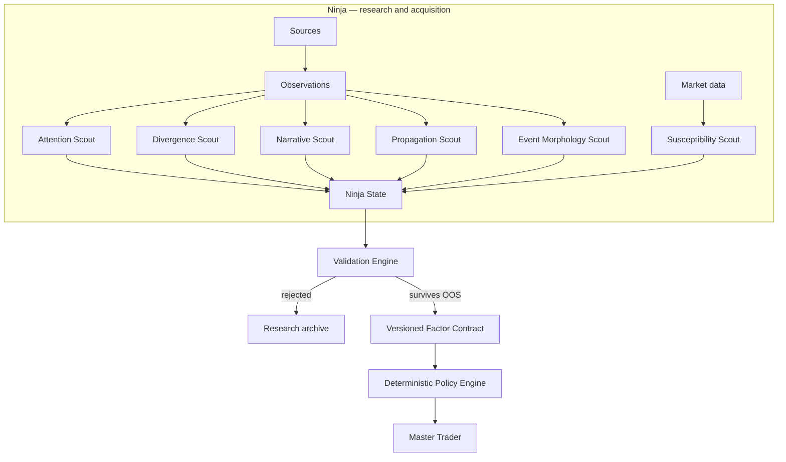

# Architecture

## Design principle

Ninja separates **information inference** from **financial action**.

The upstream side may contain probabilistic NLP, embeddings, clustering or language models. The downstream interface presented to Master Trader must be typed, timestamped, versioned and deterministic.



## Two planes

### Research plane

Allowed to be broad and experimental:

- historical datasets;
- NLP and embeddings;
- local LLMs;
- Needle or other structured classifiers;
- clustering;
- dynamic-factor models;
- Hawkes processes;
- transfer entropy;
- event studies;
- statistical / ML models.

Research-plane outputs have **zero trading authority**.

### Serving plane

Strictly controlled:

- frozen feature definitions;
- frozen model/checkpoint when a model is required;
- deterministic preprocessing;
- versioned schema;
- point-in-time timestamps;
- freshness/quality metadata;
- deterministic policy mapping.

A serving artifact must be replayable from the same input snapshot.

## Six scouts

### Attention Scout

Purpose: estimate abnormal allocation of collective attention.

Candidate features:

- message count by platform and horizon;
- unique authors;
- attention surprise;
- attention acceleration;
- author breadth;
- author entropy;
- concentration / HHI;
- effective attention;
- common attention factor;
- platform-specific attention residuals.

No feature is considered valid until replicated.

### Divergence Scout

Purpose: characterize disagreement rather than collapse discourse into one sentiment average.

Candidate features:

- mean stance;
- stance variance;
- polarization;
- cross-platform divergence;
- semantic homogeneity / echo-chamber measures.

### Narrative Scout

Purpose: measure information structure.

Candidate features:

- topic distribution;
- narrative entropy;
- narrative concentration;
- semantic novelty;
- emergence rate;
- topic change points.

### Propagation Scout

Purpose: measure movement of information through communities.

Candidate features:

- first activation timestamp by platform;
- activation order;
- platform-to-platform latency;
- cascade depth;
- multivariate Hawkes excitation matrix;
- branching / reproduction measures;
- effective / conditional transfer entropy;
- net social→market information flow.

### Event Morphology Scout

Purpose: convert heterogeneous events into comparable structural descriptions.

Proposed event representation:

```text
actor
actor_class
action
target
target_class
event_family
domain
direction
authority
credibility
confirmation
novelty
scope
affected_entities
semantic_embedding
```

Semantic extraction may use local language models, but fields that carry financial meaning must not receive arbitrary model-generated weights.

### Susceptibility Scout

Purpose: represent the market state that may amplify an information shock.

Candidate inputs:

- realized volatility;
- volume/liquidity;
- spread where available;
- open interest;
- funding;
- liquidations;
- market beta / BTC regime;
- leverage proxies;
- existing Master Trader indicators.

The key hypothesis is interaction: the same information shock can have different effects under different susceptibility states.

## Ninja State

The canonical conceptual state is:

$
N_{a,t}
=
[ATT, DIV, NAR, TRN, EVT, CTX]_{a,t}
$

No global `NinjaScore` is defined.

Premature scalar aggregation would discard potentially useful structure and introduce arbitrary weights.

## Data layers

The storage implementation is intentionally deferred, but the logical contract follows a Bronze/Silver/Gold model.

### Bronze — observations

Raw or near-raw point-in-time observations.

Minimum provenance:

```text
observation_id
source
external_id
url
author
published_at
first_seen_at
collected_at
raw_payload_hash
retrieval_version
```

### Silver — normalized information

Platform-neutral records:

```text
observation_id
platform
community
timestamp
text
language
entities
reply/repost relations
event extraction
embedding/version
classifier/version
```

### Gold — factors

Time-series features consumed by experiments and, only when validated, serving:

```text
asset
timestamp
feature_name
value
feature_version
source_coverage
freshness
quality
provenance_manifest
```

## Time semantics

For honest replay, `published_at` is not sufficient.

A historical/live decision at time $t$ may use an observation only if the system could actually have known it:

$
first_seen_at le t
$

Prospective collection therefore records at least:

- `published_at`;
- `first_seen_at`;
- `collected_at`.

Historical reconstructed data must be labeled separately from genuinely point-in-time captured data.

## Model routing

Models are tools for information normalization, not autonomous traders.

Suggested routing:

```text
literal/regex fields          → Python
entity aliases                → rules + embeddings
semantic deduplication        → embeddings
topic clustering              → embeddings/statistics
simple typed event extraction → compact classifier / Needle candidate
ambiguous extraction          → fast local LLM
hard semantic cases           → larger local LLM
financial weighting           → empirical statistical model
trade decision                → deterministic Master Trader policy
```

## Failure isolation

Ninja must never cause an unrelated Master Trader strategy to fail because a source, model or crawler is unavailable.

Rules:

1. existing strategies remain unchanged when Ninja is off;
2. shadow mode never changes an order;
3. a Ninja-aware policy must explicitly declare its freshness and quality requirements;
4. missing required Ninja input must follow that policy's declared fail mode;
5. position management must not depend on an external social source unless explicitly proven necessary.

## Repository boundary

The logical boundary is stronger than the repository boundary.

Ninja owns the *information-research domain*:

- data acquisition interfaces;
- historical research;
- information extraction;
- factor construction;
- validation;
- live factor serving.

Master Trader owns the *trading-authority domain*:

- strategy logic;
- risk authority;
- order execution;
- portfolio circuit breaking;
- capital allocation.

Today these domains are in separate repositories because their dependencies, data volumes and release cadences differ. That decision is provisional. If only a small deterministic serving surface survives research, the serving layer may later move into Master Trader while historical research remains external.

The invariant is the contract:

```text
probabilistic / research side
        ↓
versioned Ninja factors
════════ deterministic boundary ════════
Master Trader policy / execution
```

See [ADR-001](ADR-001-REPOSITORY-BOUNDARY.md).

The integration surface should remain small enough that Ninja can be replaced, relocated or merged without rewriting strategy semantics.
